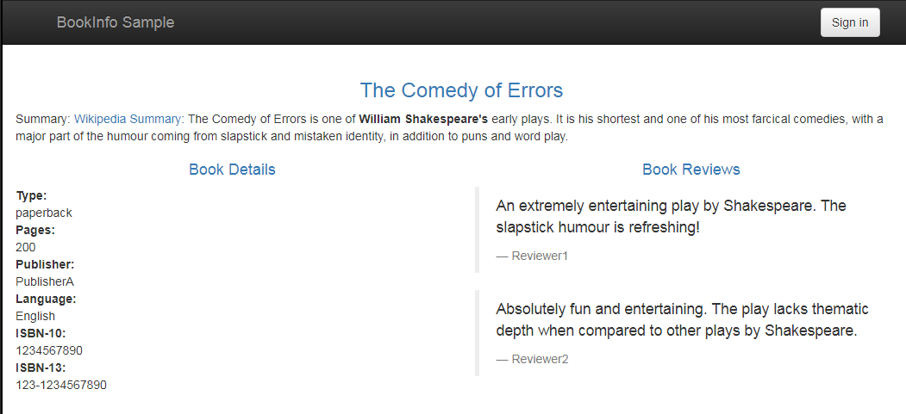

# regist data by consul istio1.7

本文内容主要描述如何基于docker 安装 istio ，并从consul 中获取注册发现数据。

istio 版本为 istio 1.7.0

## 安装依赖

* 系统安装了docker
* docker-compose 
* kubectl 

## 目录结构

```text
.
├── bin             # 需要使用的二进制文件，docker-compose 和 kubectl
├── bookinfo        # 进行测试的demo 安装和测试脚本
├── install.sh      # 安装/删除脚本 
├── istio           # 服务网格安装脚本
├── tail.sh         # 共用脚本，用于在任务执行完后输出一根横线
└── uninstall.sh
```

## 测试指南

在需要的依赖都准备好后，

### 1 安装

```text
./install.sh
```

脚本将同时安装 服务网格 istio 和 demo的bookinfo 用例

### 2 测试

在浏览器中打开 bookinfo访问页面  http://ip:9081/productpage, 能够看到如下页面



### 3 规则验证

```text
./bookinfo/rule-add.sh
```

该脚本将添加服务网格规则，将所有 reviews 的流量导向 v3 版本

```text
./bookinfo/rule-delete.sh
```

该脚本将删除规则，重新刷新 bookinfo 页面，将看到 reviews 部分显示内容每次刷新都在不同版本间切换。

### 4 卸载

```text
./uninstall.sh
```

该命令将删除所有测试的docker容器


## 完整目录

```text
# tree
.
├── bin                                          # 需要用到的工具软件
│   ├── docker-compose
│   └── kubectl
├── bookinfo                                     # 测试的demo应用
│   ├── bookinfo-down.sh                         # bookinfo demo安装
│   ├── bookinfo-up.sh 
│   ├── bookinfo.yaml
│   ├── conf                                     # sidecar 配置文件
│   │   └── mesh
│   ├── destination-rule-all.yaml                # 规则
│   ├── down.sh                                  # 安装bookinfo 及 sidecar
│   ├── env.sh
│   ├── rule-add.sh                              # istio 规则添加
│   ├── rule-delete.sh
│   ├── sidecar-down.sh                          # sidecar 卸载
│   ├── sidecar-inject.sh                        # 生成sidecar 安装的配置文件
│   ├── sidecar-restart.sh
│   ├── sidecar-up.sh
│   ├── up.sh                                    # sidecar 安装
│   └── virtual-service-review-v3.yaml           # 将流量全都导向 v3 规则
├── install.sh                                   # install istio 和 demo 
├── istio                                        # istio 安装相关配置
│   ├── conf
│   │   ├── kubeconfig
│   │   ├── mesh
│   │   └── meshNetworks
│   ├── configs.yaml                             # 需要插入到 k8s 的配置对象
│   ├── crd.sh                                   # 
│   ├── crd.yaml                                 # 需要的crd对象定义
│   ├── down.sh                                  # 卸载 istio
│   ├── env.sh
│   ├── install-base.yaml                        # 安装需要依赖的应用 apiserver,consul等
│   ├── install.yaml                             # pilot 配置文件
│   └── up.sh                                    # 安装istio 
├── tail.sh
└── uninstall.sh                                 # 卸载istio 和demo应用
```

